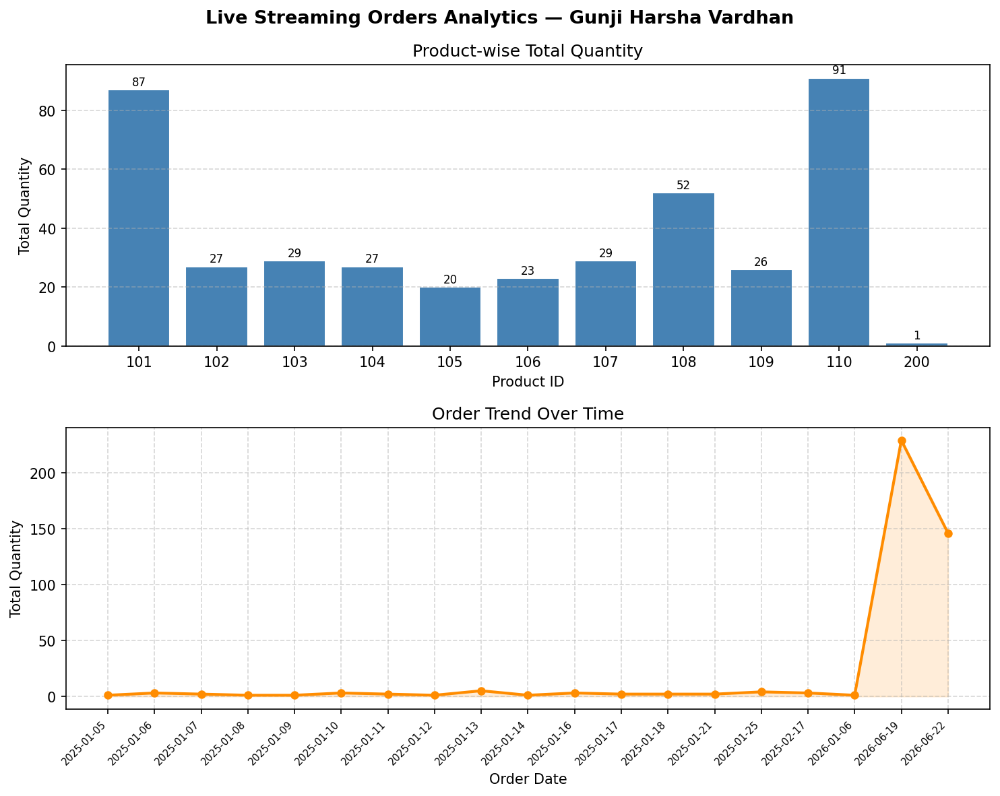

# Live Streaming Orders Analytics

## Overview

This project demonstrates real-time order analytics using Python, Pandas, Matplotlib, and SQLite.

The application watches `orders.csv` for file changes using an event-driven file watcher and only reloads data when the file is modified, making it a true streaming pipeline rather than a periodic full re-read.

---

## Architecture

```text
orders.csv
    │
    ▼ (on file-change event)
live_streamer.py  ──►  db_manager.py  ──►  orders.db (SQLite)
                                                │
                                                ▼
                                        stream_graph.py (Matplotlib)
```

---

## Module Responsibilities

| Module           | Responsibility                                                   |
| ---------------- | ---------------------------------------------------------------- |
| stream_graph.py  | Entry point; renders live bar and line charts                    |
| live_streamer.py | Background thread that watches the CSV for changes               |
| db_manager.py    | SQLite schema creation, parameterized inserts, and query helpers |

---

## Features

* Event-driven updates — graphs only redraw when the CSV file changes
* SQLite persistence — all orders are stored in SQLite for reliable querying
* Duplicate and invalid-data filtering
* Negative quantity validation
* Graceful shutdown of watcher thread and database connections
* Modular architecture with separated layers
* Real-time analytics dashboard
* Product-wise quantity analysis
* Order trend analysis

---

## Technologies Used

* Python 3.x
* Pandas
* Matplotlib
* SQLite3
* Watchdog

---

## Project Structure

```text
Live-Streaming-Orders-Analytics/
│
├── db_manager.py
├── live_streamer.py
├── stream_graph.py
├── orders.csv
├── requirements.txt
├── output_charts.png
└── README.md
```

---

## How to Run

### Step 1: Install Dependencies

```bash
pip install -r requirements.txt
```

### Step 2: Run the Application

```bash
python stream_graph.py
```

### Step 3: Simulate Live Streaming

Append new rows to `orders.csv` while the application is running.

Example:

```csv
1300,2,110,5,2026-06-24
1301,4,108,3,2026-06-24
```

The dashboard automatically updates without restarting the application.

---

## Data Validation

The application performs:

* Negative quantity removal
* Duplicate record filtering
* SQLite persistence for reliable querying
* Parameterized database operations

---

## Output

### Live Dashboard



The dashboard displays:

1. Product-wise Quantity Analysis (Bar Chart)
2. Order Trend Analysis (Line Chart)

---

## Future Enhancements

* AWS CloudWatch integration
* Streamlit dashboard deployment
* Apache Kafka streaming pipeline
* Docker containerization
* Automated alert generation
* Cloud deployment on AWS

---

## Author

**Gunji Harsha Vardhan**
